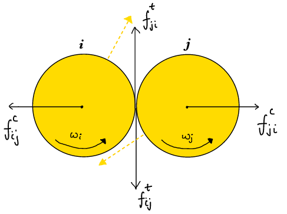

## Welcome to My documentation

This is a general-purpose classical particle dynamics simulation code that focuses on modelling particulate systems, granular matter etc. This system can be anything ranging from materials like fine powders, grains to cellular assemblies. etc.
The discrete element is a soft or a hard sphere.

This is the home page.
I will be hosting documentation for my general-purpose particle system simulator here.

This documentation is organized into the following parts:

1. [Physics Guide](General_Physics/Overview.md): 
2. [Programmer Guide](Programmer_Guide/Overview.md):

Organization of this material is simple and as readable as it can be.
This site will work as a live progress as well as documentation for my project.

1. The benefit of this code is that it generalized; it acts as a base version that can be made specific by adding
   your own code, customizing the present code.

It has git tracking as well.

??? note
    This project is complete in itself, but it can still be improved. I am working on these improvements and addition
    of several other features.

## Example systems to show

