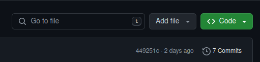
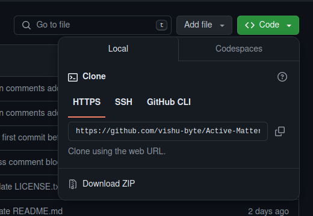

Requirements: C++ compiler, Git

This code does not require any other special dependencies.

## Clone this project from Github.com
Following these steps will help you clone this project in your local directory:


* Navigate to the main page of the repository on Github.com, whose link is available at the top right corner
of this website.

* Above the list of files, click < > **Code**. 
<figure markdown="span">
  { width="400" }
  <figcaption></figcaption>
</figure>

* Copy the URL for the repository.
    * To clone the repository using HTTPS, under "HTTPS", click copy
    * To clone the repository using an SSH key, including a certificate issued by your organization's SSH certificate authority, click SSH, then click copy
    * To clone a repository using GitHub CLI, click GitHub CLI, then click copy
        <figure markdown="span">
        { width="400" }
        <figcaption></figcaption>
        </figure> 
    

* Open Terminal.
* Change the current working directory to the location where you want the cloned directory.
* Type `git clone`, and then paste the URL you copied earlier.
```
git clone https://github.com/vishu-byte/Active-Matter-DEM-Simulation.git
```
* Press Enter to create your local clone.

This should create your local clone, you can now use the code for your own project.